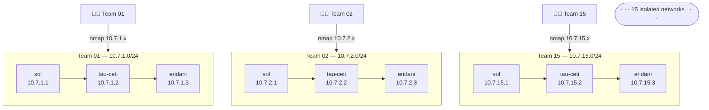
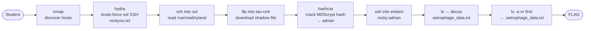

# Project Hail Mary — Lost Signal
## Docker Architecture Document

---

## Network Diagram



---

## Exploitation Flow



---

## Container Specs

Each team gets three containers on an isolated `/24` subnet: `10.7.{n}.0/24`

| Container  | IP             | Service |
|------------|----------------|---------|
| `sol`      | `10.7.{n}.1`   | SSH     |
| `tau-ceti` | `10.7.{n}.2`   | FTP     |
| `eridani`  | `10.7.{n}.3`   | SSH     |

### `sol` (10.7.{n}.1)
- **Base image:** `debian:bookworm-slim`
- **Services:** OpenSSH
- **Users:** `ryland` (password: `microbiology`)
- **Key files:** `/var/mail/ryland` — narrative email draft exposing `stratt:petrova`
- **SSH config:** `ClientAliveInterval 30`, `ClientAliveCountMax 6`

### `tau-ceti` (10.7.{n}.2)
- **Base image:** `debian:bookworm-slim`
- **Services:** vsftpd
- **Users:** `stratt` (password: `petrova`)
- **Key files:** `/home/stratt/shadow` — rocky's MD5crypt hash, accessible via FTP
- **FTP config:** `idle_session_timeout=180`, passive ports 60000–60010

### `eridani` (10.7.{n}.3)
- **Base image:** `debian:bookworm-slim`
- **Services:** OpenSSH
- **Users:** `rocky` (password: `adrian`)
- **Key files:**
  - `~/astrophage_data.txt` — decoy, contents: *"Nice try. Look closer."*
  - `~/.astrophage_data.txt` — real flag
- **SSH config:** `MaxAuthTries 3`, `ClientAliveInterval 30`, `ClientAliveCountMax 6`

---

## Deployment Options

### Docker (Classroom / Lab)
- 15 teams work **simultaneously** in fully isolated environments
- Each team gets their own private sol, tau-ceti, eridani — no interference between teams
- `generate_compose.py` produces a single `docker-compose.yml` for all 45 containers
- Students reach containers via a one-time static route — standard ports, real IPs

### Raspberry Pi (Competition)
- 3 physical Pis: one runs sol, one runs tau-ceti, one runs eridani
- All 15 teams share the same 3 servers simultaneously
- No routing setup needed — Pis and student machines are on the same physical switch
- See `pi_architecture.md` for Pi-specific setup

---

## Step-by-Step Setup Guide (Docker)

### Prerequisites
- Docker and Docker Compose installed on the host machine
- Host has a static IP on the lab network (e.g. `192.168.1.100`)
- Student machines on the same physical network as the host

### Step 1 — Build Images
```bash
docker build -t ctf-sol ./docker/sol
docker build -t ctf-tau ./docker/tau
docker build -t ctf-eri ./docker/eri
```

### Step 2 — Generate Compose File
```bash
python3 generate_compose.py
```

### Step 3 — Start All Containers
```bash
docker compose up -d
```

### Step 4 — Enable IP Forwarding on Host
```bash
sudo sysctl -w net.ipv4.ip_forward=1
```
To make permanent across reboots:
```bash
echo "net.ipv4.ip_forward=1" | sudo tee -a /etc/sysctl.conf
```

### Step 5 — Allow Student Traffic into Docker Networks
```bash
sudo iptables -I DOCKER-USER -i <physical-interface> -d 10.7.0.0/16 -j ACCEPT
sudo iptables -I DOCKER-USER -m conntrack --ctstate RELATED,ESTABLISHED -j ACCEPT
```
Replace `<physical-interface>` with the host's LAN interface (e.g. `eth0`, `ens3`).

### Step 6 — Student Machine Setup
Each student adds one route (given their team number `N` and the host IP):
```bash
sudo ip route add 10.7.<N>.0/24 via 192.168.1.100
```
This route is lost on reboot. To persist it, add to the OS's network config (e.g. `/etc/network/interfaces`).

After adding the route, students connect using standard ports and real IPs:
```bash
nmap 10.7.<N>.0/24
ssh ryland@10.7.<N>.1
ftp 10.7.<N>.2
ssh rocky@10.7.<N>.3
```

### Resetting a Team Between Runs
```bash
docker compose restart team03-sol team03-tau team03-eri
```

### Tearing Down Everything
```bash
docker compose down
```
