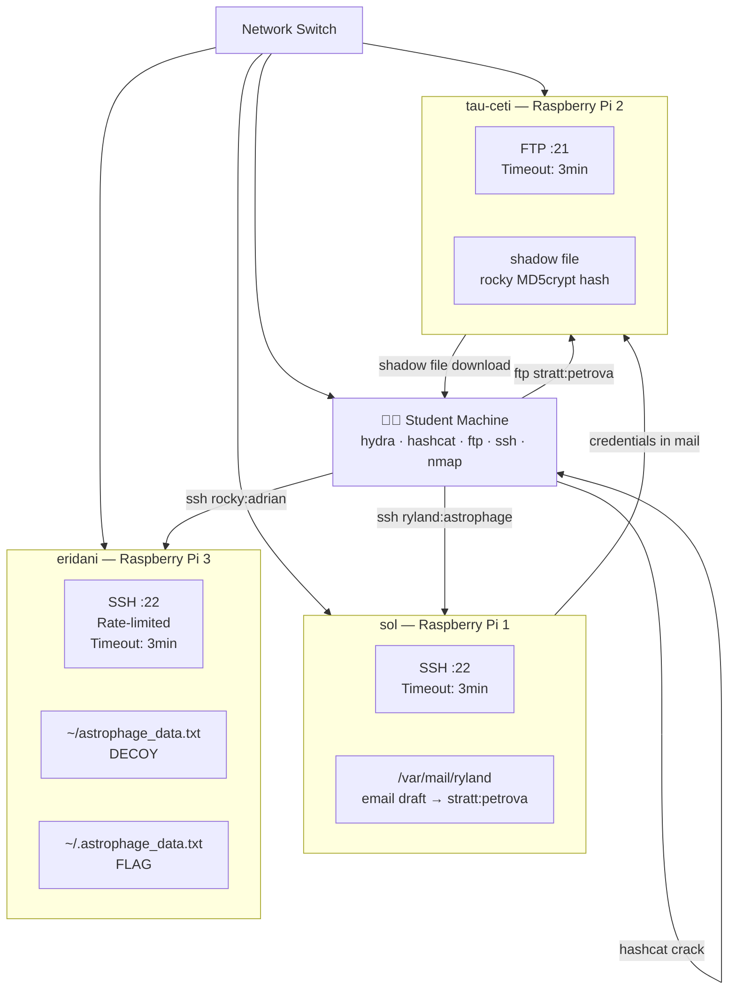
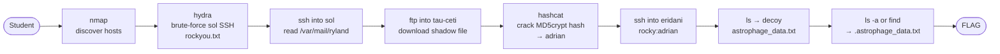

# Project Hail Mary — Lost Signal
## Raspberry Pi Architecture Document

---

## Network Diagram

---

## Exploitation Flow

---

## Hardware

| Pi | Hostname | IP | Model Recommendation |
|----|----------|----|----------------------|
| Pi 1 | `sol` | 10.7.7.1 | Raspberry Pi 3B+ or newer |
| Pi 2 | `tau-ceti` | 10.7.7.2 | Raspberry Pi 3B+ or newer |
| Pi 3 | `eridani` | 10.7.7.3 | Raspberry Pi 3B+ or newer |

- **OS:** Raspberry Pi OS Lite (64-bit, headless)
- **Network:** All three Pis and student machines on the same physical switch — no internet required
- **Static IPs:** Assigned via `/etc/dhcpcd.conf` on each Pi

---

## Pi Specs

### `sol` (10.7.7.1) — Pi 1
- **OS:** Raspberry Pi OS Lite
- **Services:** OpenSSH (`openssh-server`)
- **Users:** `ryland` (password: `astrophage`)
- **Key files:** `/var/mail/ryland` — narrative email draft exposing `stratt:petrova`
- **SSH config** (`/etc/ssh/sshd_config`):
  - `ClientAliveInterval 30`
  - `ClientAliveCountMax 6` (3 minute timeout)

### `tau-ceti` (10.7.7.2) — Pi 2
- **OS:** Raspberry Pi OS Lite
- **Services:** vsftpd
- **Users:** `stratt` (password: `petrova`)
- **Key files:** shadow file containing `rocky`'s MD5crypt hash accessible via FTP
- **FTP config** (`/etc/vsftpd.conf`):
  - `idle_session_timeout=180` (3 minutes)

### `eridani` (10.7.7.3) — Pi 3
- **OS:** Raspberry Pi OS Lite
- **Services:** OpenSSH (`openssh-server`)
- **Users:** `rocky` (password: `adrian`)
- **Key files:**
  - `~/astrophage_data.txt` — decoy, contents: *"Nice try. Look closer."*
  - `~/.astrophage_data.txt` — real flag
- **SSH config** (`/etc/ssh/sshd_config`):
  - `ClientAliveInterval 30`
  - `ClientAliveCountMax 6` (3 minute timeout)
  - `MaxAuthTries 3` (rate limiting)

---

## Setup & Reset

### Initial Setup
Each Pi is configured via a setup script run once after flashing the OS:
- `setup_sol.sh`
- `setup_tau-ceti.sh`
- `setup_eridani.sh`

### Resetting Between Runs
Unlike Docker, Pi state is persistent — files modified or read by students remain changed. Reset scripts restore each Pi to its initial challenge state:
- `reset_sol.sh`
- `reset_tau-ceti.sh`
- `reset_eridani.sh`

Reset scripts should be run between each competition heat.

### SD Card Imaging (Alternative Reset)
For full confidence, maintain a clean SD card image for each Pi. Re-flash between heats using `dd` or the Raspberry Pi Imager. Slower but guarantees clean state.

---

## Shared Server Model

All 15 teams share the same 3 Pis simultaneously. Multiple teams can be connected to the same server at the same time. Since Pis and student machines are on the same physical switch, no routing setup is required — students connect directly to `10.7.7.1`, `10.7.7.2`, and `10.7.7.3` using standard ports.
